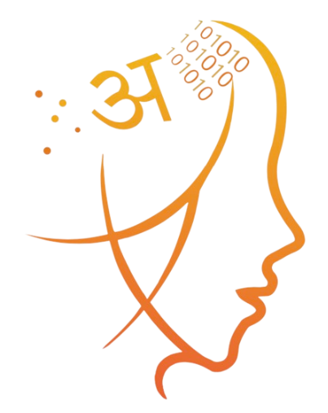

{: .text-info}
###### Logo

{: .text-info}
###### About

* The letter ‘a’ in Devanagari, i.e., ‘अ’, represents the Sanskrit language.
  - *The Māṇḍukya Upaniṣad* equates the letter ‘a’ with the universal consciousness and the waking state.
* The dots on the top left corner correspond to stars, representing the big bang, space and primordial matter.
* Binary digits (top right) represent computation and duality.
* Neural synapses represent the age of cognitive digital intelligence.

{: .text-info}
###### Download

* [Logo](./assets/images/7th_iscls_logo.png)
* [Logo with Conference Name](./assets/images/7th_iscls_logo_name.png)
* [About Logo](./assets/files/about_7th_iscls_logo.pdf)